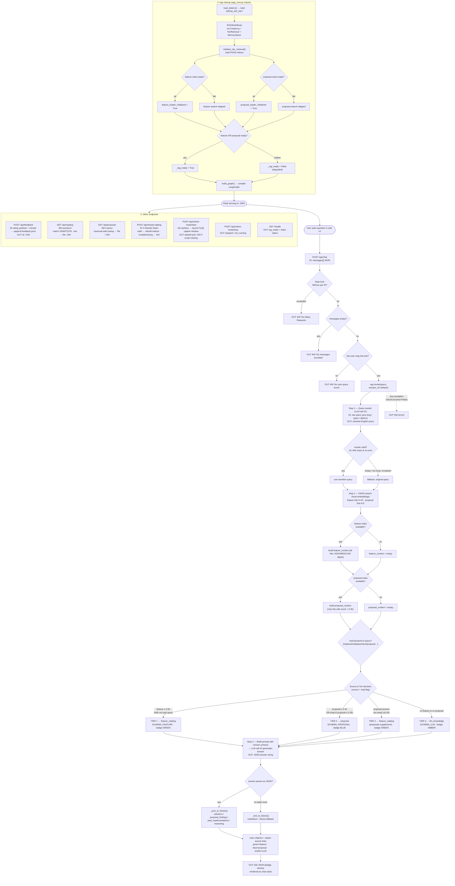

# Soldesk Chatbot — Complete Flow

End-to-end flow of the application: startup/initialization, the full `/api/chat`
RAG pipeline with every decision branch, and all auxiliary endpoints.

Source of truth: [`app_new.py`](../app_new.py) and
[`src/rag/langgraph_workflow.py`](../src/rag/langgraph_workflow.py).

## Notes

- **3-tier RAG cascade.** Every query passes through a single LangGraph node
  (`generate_response`); the "tiers" are score-threshold branches inside that
  node. Thresholds: feature `≥ 0.55`, proposal strong `≥ 0.45`, proposal present
  `≥ 0.35`.
- **Two LLM calls per request** — one to rewrite/translate the query, one to
  generate the answer. Both currently go to **Groq** (`ChatGroq`,
  `llama-3.3-70b-versatile`). These are the swap points for an OpenAI migration.
- **Startup degradation.** The app boots and serves even if one index fails to
  load; it is fully degraded (`_rag_ready = False`) only if both feature and
  proposal indices fail.
- **Local embeddings.** Retrieval uses `all-mpnet-base-v2` via
  sentence-transformers — no API key needed; only the two LLM calls require one.
- **impl-keyword override.** Words like *implement, deploy, client, proposal* can
  override a strong feature match and route the query into the proposal tier.
