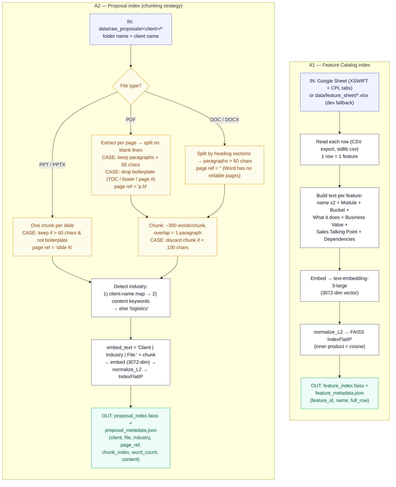
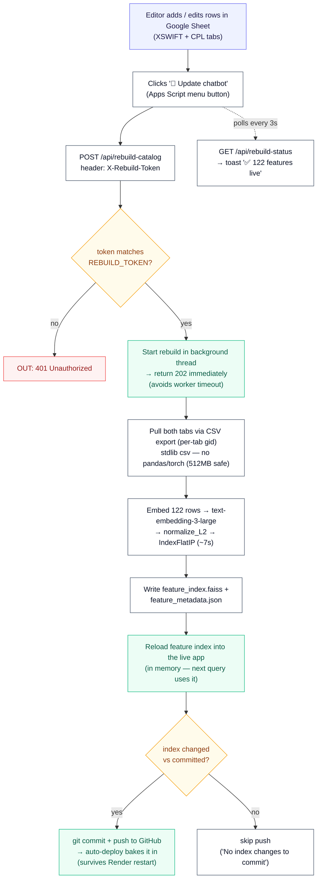
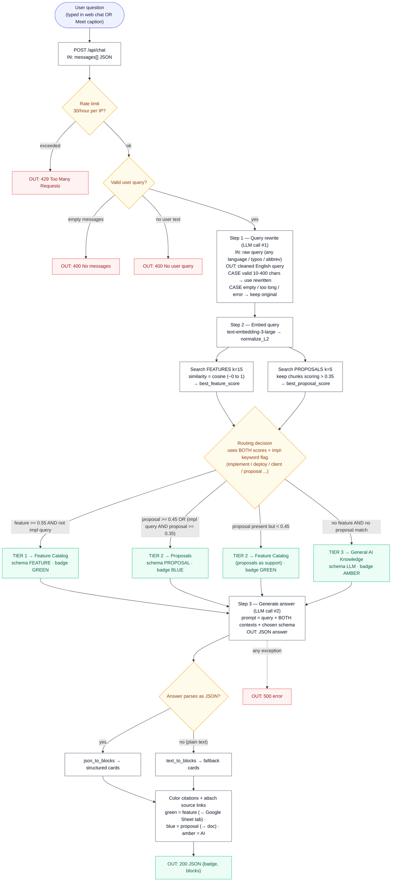
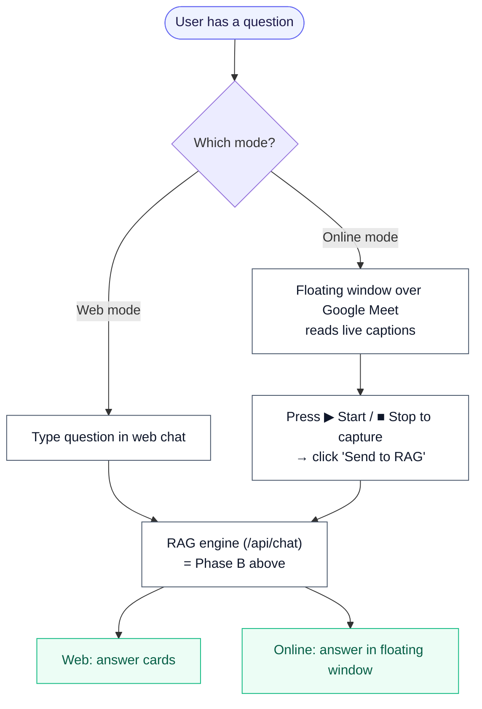

# SolutionsDesk Chatbot — Complete Workflow

A single end-to-end view of the RAG chatbot for a non-code audience:

- **Phase A — Indexing SOP** (offline): how source documents become searchable vectors (chunking strategy, embeddings, FAISS).
- **Phase A-Live — Update catalogue from Google Sheet** (live): a one-click rebuild that re-embeds the feature catalogue from a Google Sheet, with no redeploy.
- **Phase B — Query Workflow** (live): how a question becomes an answer (rewrite → parallel retrieval → similarity scoring → routing → generation → render).
- **Delivery modes**: Web Chat and Online (Google Meet) mode.

> Embeddings: OpenAI `text-embedding-3-large` (3072-dim) · LLM: OpenAI `gpt-4o-mini` (configurable) · Vector store: FAISS (cosine similarity).
> Feature catalogue source: **Google Sheet** (tabs `XSWIFT_Feature_Catalogue` + `CPL_Feature_Catalogue`); local `*.xlsx` is a dev fallback.
> Hosting: Render free tier (512 MB) — `torch`/`transformers` are blocked at startup to stay within memory.

---

## 1. Phase A — Indexing SOP (offline, run when content changes)

---

## 1-Live. Update catalogue from Google Sheet (one click, no redeploy)

The feature catalogue lives in a **Google Sheet** (tabs `XSWIFT_Feature_Catalogue` + `CPL_Feature_Catalogue`). A non-developer adds or edits rows, clicks one button in the Sheet, and the **live** chatbot re-embeds the whole catalogue — no git, no laptop, no manual `setup.py`. (Setup steps + the Apps Script live in [`docs/gsheet_rebuild_button.md`](gsheet_rebuild_button.md).)

> **Why background + CSV (not a blocking pandas read):** a synchronous rebuild on the 512 MB free tier could exceed gunicorn's 120 s timeout (cold start) and OOM the worker. So the request returns `202` at once and the work runs in a thread; the catalogue is pulled as CSV (no pandas) and `torch`/`transformers` are blocked at startup — together these keep the rebuild well under 512 MB. **Edits and additions both apply** (the whole catalogue is re-embedded). Click *after* finishing a row — the button never fires on its own, so partial rows are never embedded.

---

## 2. Phase B — Live Query Workflow (per question)

> **Key point — retrieval is parallel, not a cascade.** Both indexes are searched on every query; the thresholds only decide which source the answer leads with. The LLM always receives *both* contexts, so a feature answer can still cite a relevant past proposal.

---

## 3. Delivery modes (same engine, two front-ends)

---

## 4. Reference numbers (from the code)

| Aspect | Value / Rule |
|---|---|
| Embedding model | OpenAI `text-embedding-3-large`, 3072-dim |
| Similarity metric | Cosine (vectors `normalize_L2` + FAISS `IndexFlatIP`) |
| Chunk size | ~300 words/chunk, 1-paragraph overlap, discard if < 100 chars |
| Paragraph filter | Keep paragraphs > 60 chars; drop boilerplate (TOC, footers, page numbers) |
| Page references | PDF → `p.N` · PPT → `slide N` · Word → none |
| Retrieval depth | Features k=15 · Proposals k=5 (searched in parallel) |
| Routing thresholds | Feature strong `0.55` · Proposal strong `0.45` · Proposal present `0.35` |
| LLM calls/query | 2 (rewrite + generate) |
| Rate limit | 30 chat requests/hour per IP |

### The 3-tier answer logic
1. **Tier 1 — Feature Catalog** (green): a product feature strongly matches → answer from the catalog.
2. **Tier 2 — Proposals** (blue): a past client proposal matches better, or it's a "what did we implement" question → answer from real proposals.
3. **Tier 3 — General Knowledge** (amber): nothing in the catalog or proposals matches → answer from the AI's general knowledge, clearly labelled as such.

---

## 5. Cost per query

Current setup: **122 features, 413 proposal chunks, LLM = `gpt-4o-mini`, embeddings = `text-embedding-3-large`.**

Every query makes **3 OpenAI API calls**. FAISS search runs locally and is **free** — only the embedding + two LLM calls cost money.

| # | Call | Model | Purpose |
|---|---|---|---|
| 1 | Embed the query | `text-embedding-3-large` | Turn the question into a vector for FAISS search |
| 2 | LLM rewrite | `gpt-4o-mini` | Clean / translate the query |
| 3 | LLM generate | `gpt-4o-mini` | Write the final answer from retrieved context |

### OpenAI unit prices (per 1M tokens)

| Model | Input | Output |
|---|---|---|
| `gpt-4o-mini` (current LLM) | $0.15 | $0.60 |
| `gpt-4o` (pricier option) | $2.50 | $10.00 |
| `text-embedding-3-large` (embeddings) | $0.13 | — |

*Prices as of mid-2026 — confirm on openai.com/api/pricing, they change.*

### Cost per query — current setup (`gpt-4o-mini`)

| Call | Approx. input tokens | Approx. output tokens | Cost |
|---|---|---|---|
| Embed query | ~40 | — | ~$0.000005 |
| LLM rewrite | ~450 | ~40 | ~$0.00009 |
| LLM generate | ~3,500 | ~500 | ~$0.00083 |
| **Total per query** | | | **≈ $0.0009** |

**≈ $0.001 per query (~1,100 queries per $1).** The "generate" call is ~90% of the cost because it carries the 15 retrieved features + up to 5 proposal chunks in its prompt.

### If the LLM were switched to `gpt-4o`

| Call | Cost |
|---|---|
| Embed query | ~$0.000005 |
| LLM rewrite | ~$0.0015 |
| LLM generate | ~$0.0138 |
| **Total per query** | **≈ $0.015** (~65 queries per $1) |

Roughly **16× more expensive** than `gpt-4o-mini`, in exchange for higher answer quality.

### Monthly projection (rough)

| Queries/month | `gpt-4o-mini` | `gpt-4o` |
|---|---|---|
| 1,000 | ~$0.90 | ~$15 |
| 5,000 | ~$4.50 | ~$75 |
| 20,000 | ~$18 | ~$300 |

### One-time cost: rebuilding the index

Only when content changes and everything is re-embedded:
122 features (~15K tokens) + 413 chunks (~165K tokens) ≈ **180K tokens** × $0.13/1M ≈ **$0.02 per full rebuild** (~2 cents). Negligible.

A feature-only rebuild (the Google Sheet "🔄 Update chatbot" button) re-embeds just the 122 features (~15K tokens) ≈ **$0.002 per click** (~0.2 cents). Identical re-clicks still re-embed but skip the git push (no change to commit).

> **Caveat:** token counts are estimates; the "generate" prompt size varies with how long the feature descriptions and proposal chunks are, so real cost can swing ±30–50%. OpenAI's dashboard shows exact usage.
